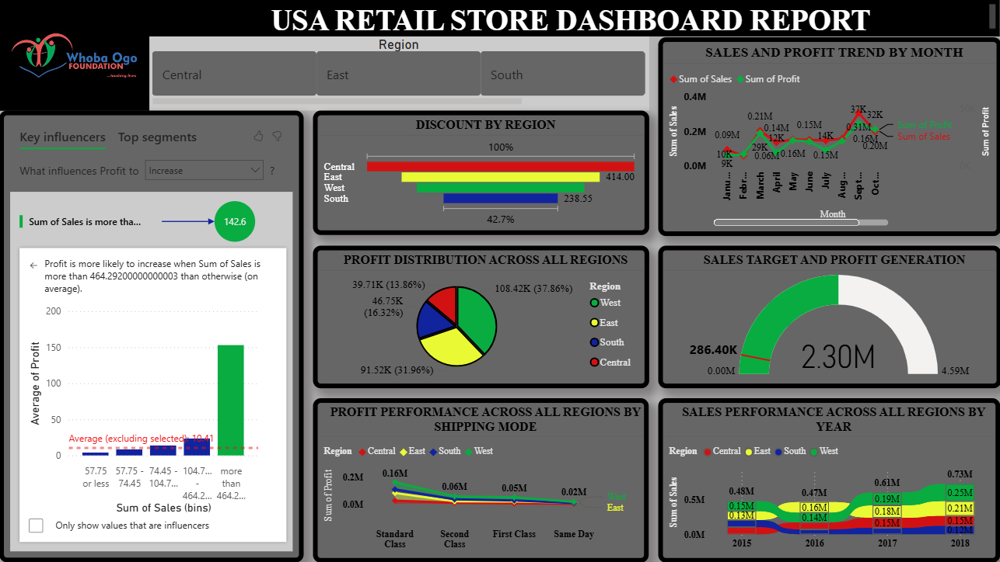

## retail_store_analysis

## Power BI Dashboard 

## Project Overview
    This project analyzes the performance of a retail store between 2015 and 2018. The objective is to evaluate sales performance, profitability, regional comparison, discounts, target achievements, trends, shipping modes and key influencers to uncover actionable insights that support business decision-making and future investments 
    
## Business Objectives
    - Understand the current performance of the retail store business 
    - Compare the sales performance of each region 
    - Identify opportunities to improve profitability
    - Evaluate progress towards organizational target
    - Provide data driven recommendations for future investments

## Dataset
    Source: retail store dataset 
    Period: 2015 to 2018
    Regions: West, East, South and Central
    Number of records: 9,994
    Columns include:
    - Shipping Date
    - Shipping Mode
    - City
    - State
    - Region
    - Sales
    - Quantity
    - Profit
    - Discount
 
## Tools used
    - Microsoft Excel for Data cleaning and preparation
    - Power BI for Data modelling and visualization 

## Business Questions
    - How is the retail store performing in terms of sales and profit 
    - Which regions are performing best, and which requires improvement
    - How does shipping mode affect profitability 
    - Is the business on track to achieve it's sales target
    - What factors have the greatest influence on profit

## Insights
    - The retail store shows a strong business growth, with sales increasing by approximately 52.1% between 2015 and 2018. However, despite generating $2.3M in total sales, the business recorded only $226K in profit, resulting in a profit margin of approximately 9.8%. This suggests that there is an opportunity to improve the conversion of revenue into profit 
    
    - The West region emerged as the strongest overall performer, contributing 37.86% of the total profit and leading in sales during 2015, 2017 and 2018. Although the East ranked first only in 2016, it demonstrated the most consistent growth, recording year-over-year sales increases throughout the four year period and contributing 31.96% of the total profit, making it a strong candidate for future investments. The South remained relatively stable, with its only notable growth occurring in 2016, when sales increased from 0.10M to 0.15M. Meanwhile, the Central region recorded the lowest overall performance despite showing gradual sales growth in 2017 and 2018, indicating that it requires the greatest strategic attention
    
    - The standard class was the most profitable shipping mode across all regions, generating a total profit of 0.16M. The East and West region contributed the larget share with 57K and 55K respectively, highlighting the standard class as the preferred shipping mode option for maximizing profitability. This was followed by the second class at 0.06M and first class at 0.05M, while same day shipping generated the lowest profit at 0.02M. In the West region, both the second and first class shipping mode generated 23K each indicating comparable profitability between the two shipping modes. Same day shipping remained the least profitable option, with both the East and West region generating 8K each.

    - The retail store has a cumulative sales target of 4.59M. Over the four-year period, it generated total sales of 2.30M, achieving 50.2% of it's target. Although the business has made measurable progress, sales remain below the expected level. If the current growth rate continues, it may require approximately another four years to achieve the overall sales target.

    - Sales is the strongest driver of profit. When sales exceed 464.3K, profit increases significantly by an averaage of 142.6K. Conversely, when sales fall between 57.75 and 74.45K, profit decreases by an average of 21.42K. If sales drop further below 57.75K, the profit reduction deepens to an average of 50.45K. This indicates that maintaining sales above these critical thresholds is essential for sustaining profitability
 
## Recommendations
    -Review production costs, operating expenses, discounts, and other deductions in order to improve profit margins, as the current profit remains relatively low compared to total sales generated.

    - The retail store gets its highest profit from the West at 37.86% followed by the East at 31.96%, these two regions represent more than 60% of the total profit, hence, they should be maintained in order to make sure they continue to generate profit for the retail store while the South and Central should be evaluated carefully to check what isn’t working, either in promotional events or demands or costs.

    - Maintain the standard class shipping mode by making it the primary shipping option, promoting it to customers through pricing incentives and default shipping selections. Improve the profitability of the same day, first class, and second class shipping by reviewing their pricing structures, operating costs, and customer demand making sure to put an end to losses incurred by the South on the same day shipping mode.
    
    - In order to meet up with the sales target, sales should be increased through targeted marketing campaigns, customer retention initiatives, establishment of quarterly sales targets and expansion into high-performing regions to accelerate progress towards the sales target, identify shortfalls early and implement corrective measures before they affect the long-term business goals

    - Prioritize strategies that consistently keep sales above the 464.3K threshold by focusing on high-performing products, customer acquisition, and upselling opportunities to maximize profitability. Early warning sysytems should be established to monitor declining sales as it reaches the 74.45K threshold in order to initiate promotional campaigns, pricing adjustments, inventory optimization to prevent significant profit reductions

## Dataset Availability

    The dataset used in this project is proprietary and cannot be shared publicly due to confidentiality and data privacy requirements. This repository includes the dashboard, methodology, business questions, analysis, insights, and recommendations to demonstrate my analytical approach while respecting the organization's data protection policies.
